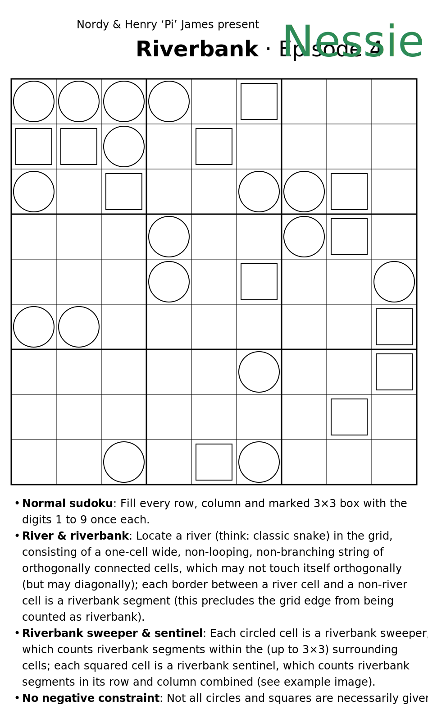
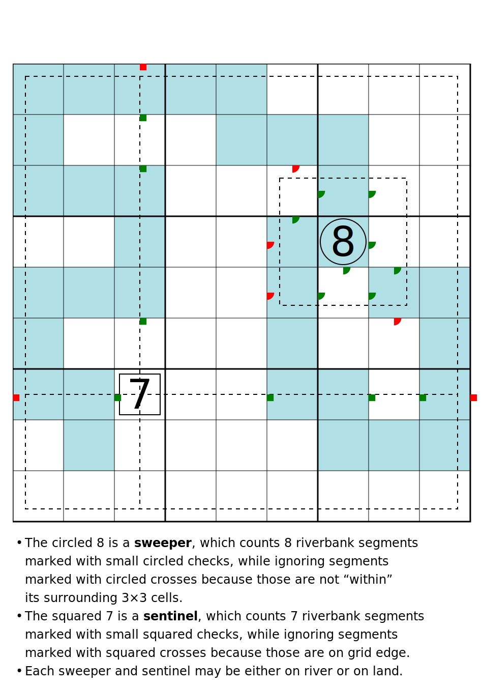

# Riverbank - Episode 4: Nessie
_by Nordy & Henry 'Pi' James_  
_published on Friday, 20 May 2022_

## Rules
- **Normal sudoku**: Fill every row, column and marked 3×3 box with the digits 1 to 9 once each.
- **River & riverbank**: Locate a river (think: classic _snake_) in the grid, consisting of a one-cell wide, non-looping, non-branching string of orthogonally connected cells, which may not touch itself orthogonally (but may diagonally); each border between a river cell and a non-river cell is a riverbank segment (this precludes the grid edge from being counted as riverbank).
- **Riverbank sweeper & sentinel**: Each circled cell is a riverbank sweeper, which counts riverbank segments within the (up to 3×3) surrounding cells; each squared cell is a riverbank sentinel, which counts riverbank segments in its row and column combined (see example image).
- **No negative constraint**: Not all circles and squares are necessarily given.
## Puzzle

## Resources
- **Download** this puzzle as: [scalable image (SVG)](riverbank_4.svg) \| [bitmap image (PNG)](riverbank_4.png) \| [printable document (PDF)](riverbank_4.pdf).  
_Note: SVG auto-switches colors depending on light/dark mode in system/browser setting; PDF is in printing-friendly black on white._
- **Play online** on: [Penpa+](riverbank_4_penpa.html) \| [CtC App](riverbank_4_ctc.html).
- **Check your solution** and **discuss** this puzzle with others at [LMD puzzle portal](https://logic-masters.de/Raetselportal/Raetsel/zeigen.php?id=0009YK).

## Acknowledgment
The (real) debut of riverbank sentinel! _@Nordy_ and I have spent close to a hundred hours combined working on this puzzle - and had so much fun doing it! The break-in, mid- and endgame each went through several rounds of significant change, while the ruleset continues to amaze us with its logical width and depth.

## License
This puzzle is published under the [Creative Commons Attribution-NonCommercial-ShareAlike 4.0 International License](http://creativecommons.org/licenses/by-nc-sa/4.0/).

