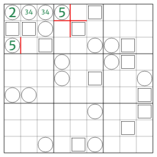
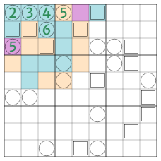
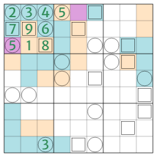
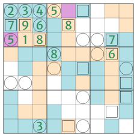
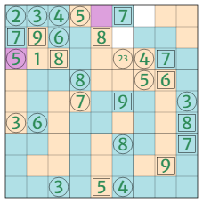
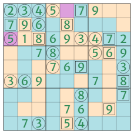
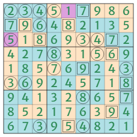

# Riverbank 4 walkthrough
_Version: 2022-06-07_

This walkthrough describes the solution path to [Riverbank - Episode 4: Nessie](./riverbank_4.html) in three parts: 1. opening, in which both ends of the river are located; 2. midgame, in which the course of the river is largely determined; 3. endgame, in which the river is finally fixed by the resulting sudoku.

## 0. Terminology

- 0.1. Geology & checkerboard: The "geology" of any cell is its property of being either river or land; a groups of orthogonally connected cells has "checkerboard geology" if within that group, neighboring cells have alternating geology (e.g. within a 2×2 block of checkerboarded cells, the riverbank segments forms a cross).
- 0.2. Visibility: A cell border is "visible to" (or "seen by" or "in sight of") a sweeper/sentinel if the former, in case of being riverbank, is counted by the latter; and a cell is visible to a sweeper/sentinel if at least one of the former's borders is visible to the latter.
- 0.3. Cliff: A cell border that is part of the grid edge is a "cliff" - either a river cliff (which never counts as riverbank) or a land cliff depending on the geology of the cell it belongs to.
- 0.4. Central domino: A sweeper at the grid edge has a "central domino" consisting of itself and the one neighboring ("front") cell away from the edge.

## 1. Opening

- 1.1. The intended break-in lies in the string of four sweepers at the start of R1 - which are a 2345 quadruple:
  - 1.1.1. The only possible values for a sweeper in a grid corner are 2/4, and for a sweeper at the grid edge (but not corner) 2-5 (proof omitted; 0 excluded from possible values as it's not allowed in this puzzle).
  - 1.1.2. A corner sweeper 4 requires the corner 2×2 block to be checkboarded (cf. ¶0.1), which always includes both river ends; whereas a corner sweeper 2 matches all cases where that block contains some river but not both ends.
  - 1.1.3. A (non-corner) edge sweeper is odd (3/5) if its central domino (cf. ¶0.4) is checkerboarded, or even (2/4) otherwise (i.e. its central domino being entirely river or land; proof omitted).
  - 1.1.4. An edge sweeper 2 requires a land central domino and some river on exactly one side of it; whereas an edge sweeper 4 requires either a river central domino with or without river on either side, or a land central domino with some river on both sides.
  - 1.1.5. An edge sweeper 3 requires the 3×2 block around it to contain no 2×2 checkerboard (i.e. no riverbank cross, which would already count 4); whereas an edge sweeper 5 requires a 2×2 checkerboard (but not an entire 3×2 checkerboard, which would either isolate a river cell or create three river ends), within which the one river cell at the grid edge is always a river end.

- 1.2. The two ends of the river are in R1 and C1 respectively - though the geology (cf. ¶0.1) of any single cell in the grid is yet to be determined:
  - 1.2.1. R1C1=2 - as the only alternative corner sweeper value is 4, which requires R1C2 and R2C1 to be the two river ends, making R1C2=3 and R1C3 no value.
  - 1.2.2. R1C4=5 - because in a 2345 string of edge sweepers, the (mandatory) 2×2 checkerboard around the 5 cannot overlap with the central domino of either 2/4 (turning it odd, cf. ¶1.1.3) or 3 (turning it into another 5, cf. ¶1.1.5); so that 2×2 checkerboard can only be R12C45 (away from the quad), with either R1C4 or R1C5 being a river end.
  - 1.2.3. By sudoku, R3C1 - which is also an edge sweeper and therefore from 2-5 - is now 5 as well, making R2/3/4C1 the other river end.

  

- 1.3. R1C4 is land - as a river starting there and going left would either be penned in by the 2×2 checkerboard around R3C1 or make R2C3 impossible - and the geology of entire B1 is fixed:
  - 1.3.1. Given the R12C45 checkerboard, if R1C4 were river, it must be a river end, coming out via R1C3 onto either R1C2 or R2C3.
  - 1.3.2. If the river goes R1C4, R1C3, R1C2 (making R2C3 land), the 2×2 checkerboarde around R3C1 cannot be R23C12, as that would pen the river in, so it must be R34C12, allowing the river to come out via R2C2, R3C2, R3C3, making R2C3=5 by sweeper count (regardless of R3C4's geology) - thus clashing with R3C1.
  - 1.3.3. If the river goes R1C4, R1C3, R2C3 (making R1C2 land), it must continue onto R2C2 (or else R1C2=2 and R1C1=0 by sweeper count) and is now definitely penned in by R3C1's 2×2 checkerboard - no matter its location and geology.
  - 1.3.4. R1C4 being land means R2C5 is too, whereas R1C5 is a river end coming out to R1C6, and R2C4 a river corner that makes both R2C3 and R3C4 river, and R3C3 land.
  - 1.3.5. The only way R3C1's 2×2 checkerboard can avoid creating a third river end now is for it to be R34R12, with R3C2 and R4C1 being land; R3C1 is a river end that comes out via R2C1, missing R2C2 (or else R1C3=R1C4=3 by sweeper count), onto R1C1, R1C2, R1C3, making R1C2=3, R1C3=4, and R2C4=6 (all by sweeper count); R4C2 is a river corner that makes R4C3&4 and R5C2 river, and R3&4C5 and R5C3&4 land.

  

## 2. Midgame

- 2.1. The three sentinels in B1 are resolved - narrowing down the course of the river in the upper-right and the lower-left corners in the process:
  - 2.1.1. The only place for 1 in B1 is R3C2, since the three sentinels are all seeing (cf. ¶0.2) more than 1 riverbank already - they're now a 789 triple.
  - 2.1.2. The (odd/even) parity of any sentinel is solely dependent on the four cliffs (cf. ¶0.3) in its sight - an odd sentinel sees 1 or 3 river cliffs, an even sentinel sees 0, 2, or 4 (proof omitted).
  - 2.1.3. With only the last four cells each of R2-4 being undetermined in their geology, the river must simply move down from R1 to R5 (with some possible horizontal movement) as it doesn't have enough space to go back up and down again; the sentinel counts for R1-4 are 2/3, 4/5, 4/5, 3/4 respectively, each depending on whether that row ends in a river or land cliff.
  - 2.1.4. For R2C1 to reach a sentinel count of at least 7, the river must move back to C1 then out to C5 - without any additional back and forth (again because there's not enough space left); the sentinel counts for C1-4 are 2/3, 4/5, 4/5, 3/4 respectively (just like R1-4, coincidentally).
  - 2.1.5. It's not possible for R2C9 to be river and R3C9 to be land, same goes for R9C2 and R9C3, therefore the sentinel count of R3C3 cannot exceed that of R2C2 in either row or column; and since R2C1 too sees the same riverbanks as R2C2 in row and fewer in column, R2C2=9 as the largest of the trio.
  - 2.1.6. R3C3=8 as it sees at least 4 riverbanks each in row and column, making both R3C9 and R9C3 river; R2C1=7 by sudoku.
  - 2.1.7. R9C3=3 by elimination of other edge sweeper values - 2 ruled out by it being river (cf. ¶1.1.4), 4 ruled out by R1C3, 5 ruled out by there being no river end left (cf. ¶1.1.5); that makes R8C3 land (cf. ¶1.1.3), and R9C2 and R9C4 river.
  - 2.1.8. R9C2 being river forces R2C9 to be land - and with it, R1C9 as well - in order to fulfill R2C2 (cf. ¶2.1.2); now R7&8&9C1 are river and R8C2 land to fulfill R2C1; R3C9 has become a river corner, making R3C8 and R4&5C9 river, and R4C8 land.

  

- 2.2. The three sentinels in C8 are resolved - further fixing the river:
  - 2.2.1. The gaps in R4 and C3 are too narrow for the river to get in and out again, so R4C6&7 and R6&7C3 are all land; R1C8 is land because otherwise the river goes R1C6, R1C7, R1C8, R2C8, R3C8 - leaving R3C6 with a sweeper count of 0.
  - 2.2.2. R2C5=8 as this sentinel counts 5 in row and at least 2 in column, but 7 and 9 are ruled out by sudoku; so the sentinel count of C5 is 3, making R9C5 land and R8C4 river.
  - 2.2.3. The sentinel counts for R3/4/8 and C8 are 4, 3, 2-7, and 3-7 respectively, so R3C8 is either 7 or 9 (8 ruled out by R3C3), meaning the count for C8 is either 3 or 5, making R9C8 river in either case (cf. ¶2.1.2).
  - 2.2.4. The sentinel count for C8 must now be 3, as otherwise it'd be 5 and make R3C8=9, R4C8=8, and R8C8=7 (at most) - with R8 having a sentinel count of 2 only, making R8C4 through R8C9 all river, conflicting with R9C8 already being river; so R3C8=7, R4C8=6, and R8C8 is either 8 or 9 depending on R8C9's geology.
  - 2.2.5. R4C4=8 since every interior (i.e. non-corner, non-edge) sweeper on river is either 5/7/9 if it's a river end, or 6/8 otherwise (proof omitted), and this one cannot be 6 because of R4R8; that forces R5C5 to be river - and a river corner, making R5C6&7 and R6C5 river, and R6C6 land.
  - 2.2.6. The gap in C5 is again too narrow for the river to move through it and back again, so in order to ensure that the river gets to R9C8, it cannot directly connect at R5C8 - nor at R6C8 or R7C8, meaning R5&6&7C8 are land, and R6&7C7 and R6&7&8C9 river.

  

- 2.3. Various sweepers and sentinels work together to determine the river's course almost entirely:
  - 2.3.1. R3C7 is land - and with it, R3C6 too - because otherwise R4C7 has a sweeper count of 6, colliding with R4C8; R2C7&8 are now river, R4C7=5, R3C7=4, R3C6 is either 2 or 3 depending on R2C6's geology.
  - 2.3.2. R6C9 and R7C9 see the same riverbanks in column and need different counts in row, which can only be achieved by making R6C1 land; R5C1 is land too, and R6&7C2 river, making R6C1=3 and R6C2=6.
  - 2.3.3. R5C6=9 as that's now its minimum sentinel count, which makes R9C6 river - and a river corner; R7&8C6 and R9C7 are therefore river too, R7&8C5 and R8C7 land, R6&7C4 river; R1C6=7, R5C4=7, R5C9=3, R7C6=8, R9C6=4, R8C8=9.
  - 2.3.4. R9C9 is river - or else R7C9 would count 8 and collide with R7C6 - and R8C8 is land; R6C9=8, R7C9=7, R9C5=5.

  

## 3. Endgame

- 3.1. By sudoku, all 7s in the grid can be located (B6, B8, B7, B4), then several 6s (B5, B2, B8) and 9s (B6, R4, B3, B4), so now R3 only has 2/3 left, with R3C9=2 and R3C6=3, making R2C6 river and R1C7 land - the river is finally complete.

  

- 3.2. The whole grid can be finished by sudoku in the following order: B2, R1, C9, C6, R4, C5, R6, B6, B3, C8, C3, B4, C2, R8, R7, R9.

  
